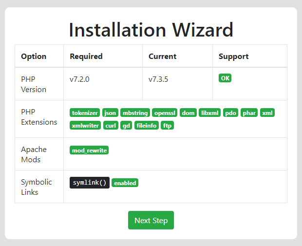
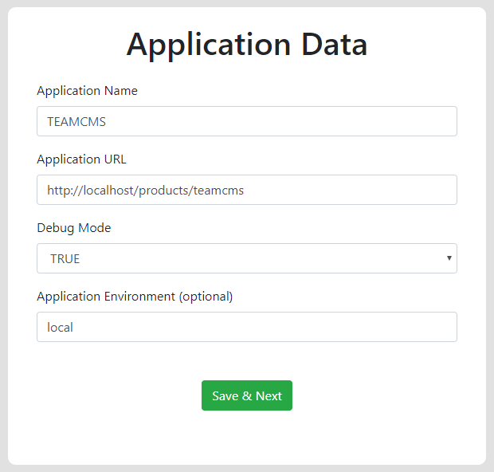
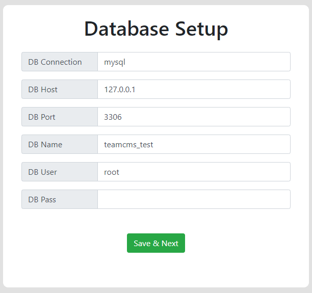
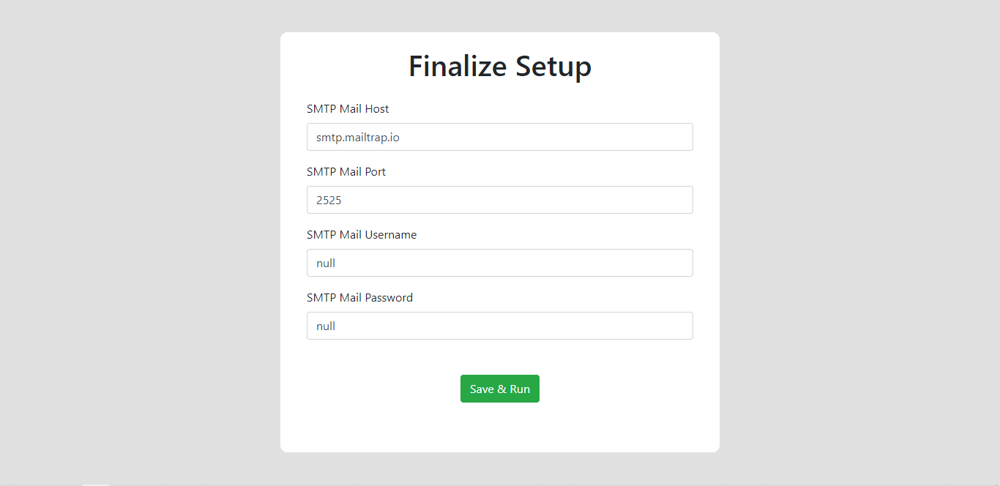

# Larataller - A Minimalist Laravel Installer Package

[](https://packagist.org/packages/dgvai/larataller)
[](https://packagist.org/packages/dgvai/larataller)
[](https://packagist.org/packages/dgvai/larataller)
[](https://packagist.org/packages/dgvai/larataller)
[](https://packagist.org/packages/dgvai/larataller)
[](https://packagist.org/packages/dgvai/larataller)
[](https://packagist.org/packages/dgvai/larataller)

The installer package you need for your laravel application in release field. The simplest, minimalistic installer for your application. Works on any laravel version!

## Contents

<!-- TOC -->

- [Larataller - A Minimalist Laravel Installer Package](#larataller---a-minimalist-laravel-installer-package)
    - [Contents](#contents)
    - [Installation](#installation)
        - [Publish Configuration](#publish-configuration)
        - [Setup and configure](#setup-and-configure)
    - [Usage](#usage)
        - [Additional Notes](#additional-notes)
    - [Examples](#examples)
    - [Advanced Usage](#advanced-usage)
    - [Changelog](#changelog)
    - [License](#license)

<!-- /TOC -->

## Installation

You can install the package via composer:

``` bash
    composer require dgvai/larataller
```

### Publish Configuration

Publish configuration file

```bash
    php artisan vendor:publish --tag=larataller
```

**For users bellow laravel < 5.5**
Add service provider to config/app.php
```php
    '"DGvai\Larataller\LaratallerServiceProvider"'
```

### Setup and configure

The installer configuration is the only major work for this package. So follow carefully this step.  
The configuration file ``config/larataller.php`` comes with some installation properties. The properties are also well documented in the comment of the file. Also, a brief description is given here:

```php
    'php' => [
        
            /**
             * MINIMUM PHP VERSION
             * --------------------------------------
             * Define the minimum php verison 
             * required for you application
             * 
             */

            'min' => '7.3.0',

            /**
             * REQUIRED PHP EXTENSIONS
             * --------------------------------------
             * Define here which extensions are
             * required for your application.
             * 
             */

            'exts' => ['tokenizer','json'],
        ],

        /**
         * REQUIRED APACHE MODULES
         * --------------------------------------
         * Define here which modules are
         * required for your application.
         * 
         */
        
        'apache' => [
            'mods' => ['mod_rewrite'],
        ],

        /**
         * CHECK FOR SYMLINK
         * --------------------------------------
         * If your migration contains the artisan
         * command of storage:link , or any 
         * symbolic link operation, then you 
         * might need to check if your hosting/system
         * service supports creating symlinks
         * 
         */

        'symlink' => false,

        /**
         * PERFORM MIGRATION?
         * --------------------------------------
         * Does you application runs migration 
         * to setup your database?
         * 
         */

        'migration' => true,

        /**
         * SQL FILE NAME
         * --------------------------------------
         * If your application does not use
         * migration to setup db, and you want
         * to use .sql file to upload to DB
         * to setup, define its name here.
         * 
         * It should be placed inside public_path
         *    public_path().'/install/mysqlsite_db.sql'
         * 
         * 
         * example: 'sql' => 'mysqlsite_db.sql'
         * 
         */

        'sql' => null, 

        /**
         * EXTRA ENV DATA
         * --------------------------------------
         * If you want to setup some more 
         * env attribute during setup time,
         * place them bellow here.
         * 
         */

        'extra' => [
            [
                'key' => 'ENV_KEY_NAME',
                'title' => 'Title For The Key'
            ]
        ],

        /**
         * COMPLETE INSTALLATION REDIRECT
         * --------------------------------------
         * Redirect after completing the 
         * installation.
         * Provide route() name here.
         * 
         * example: home.dashboard
         */

        'redirect' => null,
```


After done configuraing
```bash
    php artisan config:cache
```

## Usage

- Install this package
- Keep a skeleton .env file with an initial ``APP_KEY`` Generated
- Browse ``yoursite.com/install`` to get started.

### Additional Notes
- You do not need to delete any file or uninstall the package after installation, it's middleware protected
- If you want to change the APP_KEY after installation, keep a migration with ``Artisan::call('key:generate')``
- Installer setup is always developer-end work, so be sure your migration runs without any bug normally. A developer can manually check the migration from fresh terminal install, even the installer give the migration output, the user can not debug your migration errors. So before applying installer, be sure about your migrations.

## Examples 





## Advanced Usage

Export the views to customize your design of installer! (If you wish to customize)

```bash
    php artisan vendor:publish --tag=larataller-views
```

## Changelog

Please see [CHANGELOG](CHANGELOG.md) for more information what has changed recently.

## License

The MIT License (MIT). Please see [License File](LICENSE.md) for more information.
